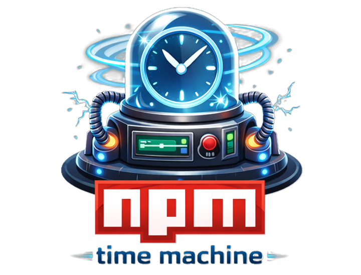

<p align="center">
  
</p>

<h1 align="center">NTM: NPM Time Machine</h1>

Reproduce your npm dependency tree as it existed at a specific point in time.

## 🚀 Why?

Supply chain attacks and breaking changes often come from newly published versions of dependencies.

`npm-time-machine` lets you:

- Install dependencies as they existed in the past
- Avoid recently introduced malicious or unstable versions
- Reproduce old environments reliably

## ⚡ Features

- 🔙 Time-based dependency resolution
- 📦 Works with all dependencies (including sub-dependencies)
- 🛡️ Reduces exposure to recent supply chain attacks
- 🔍 Verify installed packages against a date
- 🧹 Reset project state easily

## 📦 Installation

```bash
npm install -g npm-time-machine-cli
```

Or use with `npx`:

```bash
npx npm-time-machine-cli <command>
```

## 🎯 Usage

### 1️⃣ Set Target Date

First, specify the date you want to freeze dependencies to:

```bash
ntm set 2024-01-15
```

This saves your target date to `.npm-time-machine/config.json`.

### 2️⃣ Install Dependencies

Install packages using the frozen date:

**Install all dependencies from `package.json`:**
```bash
ntm install
```

**Install specific packages:**
```bash
ntm install express lodash
```

Only versions published **before or on** the target date will be installed.

**Options:**
- `--fallback` - If no version exists before the date, use the oldest available version
  ```bash
  ntm install --fallback
  ```
- `--allow-prerelease` - Include pre-release versions (e.g., alpha, beta, rc) in version resolution
  ```bash
  ntm install --allow-prerelease
  ```

### 3️⃣ Verify Packages

Check if your `package-lock.json` matches the target date:

```bash
ntm verify
```

This will warn you about any packages installed **after** your target date.

**Override date temporarily:**
```bash
ntm verify 2023-06-01
```

### 4️⃣ Reset Configuration

Remove ntm configuration:

```bash
ntm reset
```

## 📚 Examples

### Scenario 1: Install dependencies from 2 years ago

```bash
ntm set 2024-01-01
ntm install
# Your project now has all dependencies as they existed on Jan 1, 2024
```

### Scenario 2: Use fallback for legacy packages

```bash
ntm set 2020-05-15
ntm install --fallback
# If a package didn't exist by May 2020, uses its oldest version
```

### Scenario 3: Verify a historic lock file

```bash
ntm verify 2023-12-31
# Checks if package-lock.json complies with Dec 31, 2023 timeline
```

## 🔧 How It Works

1. **Proxy Server** - Starts a local npm registry proxy on a random port
2. **Version Filtering** - Intercepts npm requests and filters available versions by publish date
3. **Registry Redirect** - npm CLI uses the proxy instead of the real registry
4. **Caching** - Responses are cached to reduce registry calls
5. **Cleanup** - Proxy automatically closes after installation

### Strict vs Fallback Mode

- **Strict (default)** - Fails if no version exists before the target date
- **Fallback** - Uses the oldest available version as a last resort

## ⚠️ Important Notes

- **Requires Node 18+** - Uses ES modules
- **Local Proxy** - Creates a temporary local server (doesn't modify global npm config)
- **Package Lock** - Works best with existing `package-lock.json` (or `npm-shrinkwrap.json`)
- **Offline** - Still requires internet to fetch package metadata
- **Transitive Dependencies** - Automatically handles sub-dependencies

## 🐛 Troubleshooting

### "No config found. Run 'ntm set <date>' first"
You haven't set a target date yet. Run:
```bash
ntm set YYYY-MM-DD
```

### "No versions available before selected date"
The package didn't exist on that date. Use:
```bash
ntm install --fallback
```

### "npm install failed"
The proxy closed unexpectedly. Check:
- Internet connection
- npm is properly installed
- No processes hogging ports

### Port-related errors
The proxy randomly selects ports. If you get port errors, try again—it should work on retry.

## 📋 Commands Reference

| Command | Purpose |
|---------|---------|
| `ntm set <date>` | Set target date (YYYY-MM-DD format) |
| `ntm install [packages...]` | Install with frozen timeline |
| `ntm install --fallback` | Install with fallback mode enabled |
| `ntm install --allow-prerelease` | Install including pre-release versions |
| `ntm verify [date]` | Verify packages match a date |
| `ntm reset` | Remove ntm configuration |

## 🛡️ Security Considerations

- **Supply Chain Protection**: Lock dependencies to a known-safe date before attacks occurred
- **Audit Checking**: Always run `npm audit` after installation
- **Trust Verification**: Verify publication dates match expectations
- **Locked Dependencies**: Use `npm ci` instead of `npm install` in CI/CD

## 👤 Author

Marco Lo Pinto

## 🤝 Contributing

Contributions welcome! Feel free to open issues or submit pull requests on GitHub.


## ⚡ Quick Start

```bash
# 1. Install globally
npm install -g npm-time-machine

# 2. Set a date in your project
cd your-project
ntm set 2024-06-01

# 3. Install dependencies
ntm install

# 4. Verify everything is correct
ntm verify
```

You now have a reproducible, time-locked dependency tree! 🎉
